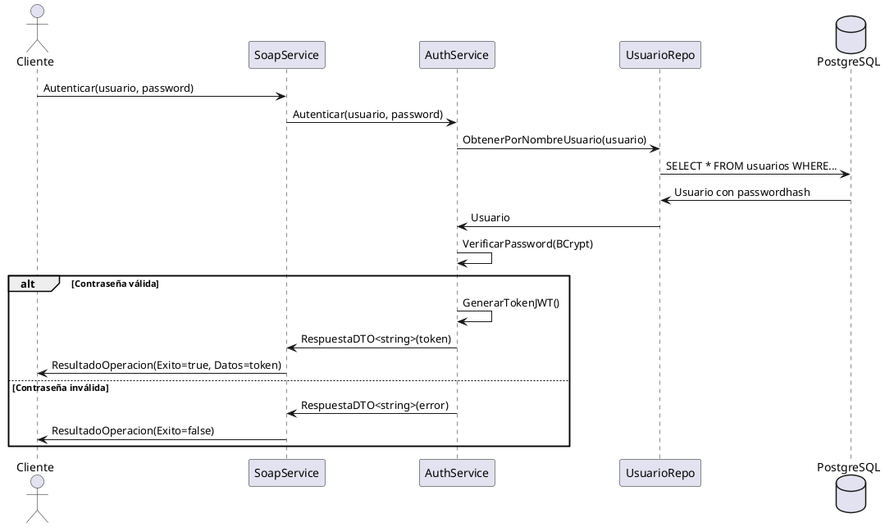

# ?? GUÍA COMPLETA PARA ANAHY - Responsable de Documentación y Base de Datos

---

## ?? TU MISIÓN

Eres la **Arquitecta de Datos y Documentalista del Proyecto**. Mientras Oscar programa el backend y Camila la UI, tú:

1. ? Diseñas y documentas la arquitectura completa
2. ? Creas y mantienes la base de datos
3. ? Produces toda la documentación técnica (ERS, DDA, informes)
4. ? Coordinas las evidencias de pruebas
5. ? Consolidas el informe final y presentación

---

## ?? CHECKLIST DE TAREAS

### **FASE 1: Análisis y Diseño (Días 1-2)**

#### ? **Tarea 1.1: ERS - Especificación de Requisitos**
**Archivo:** `docs/01-ERS/ERS_InventarioFerreteria.md` (YA CREADO ?)

**Acciones:**
- [ ] Revisar y completar casos de uso (UC01-UC05)
- [ ] Crear diagrama de casos de uso (UML) con herramienta:
  - Draw.io: https://app.diagrams.net/
  - Lucidchart: https://www.lucidchart.com/
  - PlantUML: https://plantuml.com/
- [ ] Guardar diagrama como `docs/Diagramas/casos-de-uso.png`
- [ ] Validar que todos los RF y RNF estén completos
- [ ] Agregar criterios de aceptación específicos

**Herramientas recomendadas:**
```bash
# Opción 1: Draw.io (online o desktop)
https://app.diagrams.net/

# Opción 2: PlantUML (código a diagrama)
@startuml
left to right direction
actor "Administrador" as admin
actor "Usuario" as user
actor "Cliente SOAP" as soap

rectangle "Sistema Inventario" {
  usecase "Registrar Artículo" as UC01
  usecase "Consultar Artículo" as UC02
  usecase "Actualizar Artículo" as UC03
  usecase "Insertar Artículo (SOAP)" as UC04
  usecase "Consultar por Código (SOAP)" as UC05
}

admin --> UC01
admin --> UC02
admin --> UC03
user --> UC02
soap --> UC04
soap --> UC05
@enduml
```

#### ? **Tarea 1.2: Modelo de Datos**
**Archivos:** 
- `docs/Diagramas/modelo-er-logico.png`
- `docs/Diagramas/modelo-er-fisico.png`
- `docs/Scripts-SQL/01-create-schema.sql` (YA CREADO ?)

**Acciones:**
- [ ] Crear diagrama ER lógico (entidades sin tipos de datos)
- [ ] Crear diagrama ER físico (tablas con tipos, PKs, FKs)
- [ ] Herramienta recomendada: **DBDiagram.io** o **pgModeler**

**Ejemplo para DBDiagram.io:**
```sql
// dbdiagram.io
Table usuarios {
  id integer [pk, increment]
  nombreusuario varchar(50) [unique, not null]
  passwordhash varchar(255) [not null]
  rol varchar(20) [not null, default: 'Usuario']
  fechacreacion timestamp [not null, default: `now()`]
  activo boolean [not null, default: true]
}

Table articulos {
  id integer [pk, increment]
  codigo varchar(50) [unique, not null]
  nombre varchar(200) [not null]
  categoriaid integer [ref: > categorias.id]
  proveedorid integer [ref: > proveedores.id]
  preciocompra decimal(10,2) [not null]
  precioventa decimal(10,2) [not null]
  stock integer [not null, default: 0]
  stockminimo integer [not null, default: 5]
  activo boolean [not null, default: true]
}

Table categorias {
  id integer [pk, increment]
  nombre varchar(100) [unique, not null]
  descripcion text
}

Table proveedores {
  id integer [pk, increment]
  nombre varchar(150) [unique, not null]
  telefono varchar(20)
  email varchar(100)
  direccion text
}

Table logoperaciones {
  id integer [pk, increment]
  operacion varchar(50) [not null]
  entidad varchar(50) [not null]
  usuarioid integer [ref: > usuarios.id]
  fechahora timestamp [not null, default: `now()`]
}
```

Luego exporta como PNG y guarda en `docs/Diagramas/`.

#### ? **Tarea 1.3: Crear Base de Datos en PostgreSQL**

**Pasos:**

1. **Abrir pgAdmin o psql**
```bash
# Opción 1: psql (terminal)
psql -U postgres

# Opción 2: pgAdmin (GUI)
# Abrir pgAdmin ? Create Database
```

2. **Crear la base de datos**
```sql
CREATE DATABASE ferreteria
    WITH 
    OWNER = postgres
    ENCODING = 'UTF8'
    LC_COLLATE = 'Spanish_Ecuador.1252'
    LC_CTYPE = 'Spanish_Ecuador.1252'
    TABLESPACE = pg_default
    CONNECTION LIMIT = -1;
```

3. **Ejecutar el script de creación**
```bash
# En psql:
\c ferreteria
\i 'C:/Users/Anahy/Desktop/InventarioFerreteria/docs/Scripts-SQL/01-create-schema.sql'

# O desde terminal:
psql -U postgres -d ferreteria -f "C:\Users\Anahy\Desktop\InventarioFerreteria\docs\Scripts-SQL\01-create-schema.sql"
```

4. **Verificar creación**
```sql
-- Ver tablas
\dt

-- Ver datos
SELECT * FROM categorias;
SELECT * FROM proveedores;
SELECT * FROM articulos;
SELECT * FROM usuarios;
```

5. **?? IMPORTANTE: Hashear Contraseñas**

**Las contraseñas actuales están en texto plano. Necesitas hashearlas con BCrypt.**

**Opción A: Usar herramienta online (temporal)**
```
https://bcrypt-generator.com/
Input: Admin123!
Output: $2a$12$XXXXXXXXXXXXXXXXXXXXXXXXXXXXXXXXXXXXXXXXXXXX
```

**Opción B: Crear script C# (recomendado)**
```bash
cd C:\Users\Anahy\Desktop
dotnet new console -n HashGenerator
cd HashGenerator
dotnet add package BCrypt.Net-Next
```

Edita `Program.cs`:
```csharp
using BCrypt.Net;

Console.WriteLine("=== Generador de Hashes BCrypt ===\n");

string[] passwords = { "Admin123!", "Usuario123!" };

foreach (var pwd in passwords)
{
    string hash = BCrypt.HashPassword(pwd);
    Console.WriteLine($"Password: {pwd}");
    Console.WriteLine($"Hash BCrypt: {hash}\n");
}
```

Ejecuta:
```bash
dotnet run
```

Copia los hashes y ejecuta en PostgreSQL:
```sql
UPDATE usuarios 
SET passwordhash = '$2a$12$HASH_ADMIN_AQUI'
WHERE nombreusuario = 'admin';

UPDATE usuarios 
SET passwordhash = '$2a$12$HASH_USUARIO_AQUI'
WHERE nombreusuario = 'usuario';

-- Verificar
SELECT nombreusuario, LENGTH(passwordhash) as hash_length FROM usuarios;
-- Debería mostrar hash_length = 60
```

---

### **FASE 2: Diseño Arquitectónico (Días 3-4)**

#### ? **Tarea 2.1: DDA - Documento de Diseño Arquitectónico**
**Archivo:** `docs/02-DDA/DDA_InventarioFerreteria.md` (YA CREADO ?)

**Acciones:**
- [ ] Crear diagrama de arquitectura N-Capas
- [ ] Crear diagrama de componentes (UML)
- [ ] Crear diagramas de clases para cada capa
- [ ] Crear diagramas de secuencia (UC01-UC05)
- [ ] Crear diagrama de despliegue
- [ ] Documentar especificación WSDL/XSD completa

**Diagramas a crear (guárdalos en `docs/Diagramas/`):**
1. `arquitectura-n-capas.png` - Diagrama de capas
2. `diagrama-componentes.png` - Componentes UML
3. `diagrama-clases-entidades.png`
4. `diagrama-clases-negocio.png`
5. `diagrama-clases-soap.png`
6. `secuencia-autenticacion.png`
7. `secuencia-insertar-articulo.png`
8. `secuencia-consultar-articulo.png`
9. `diagrama-despliegue.png`

**Herramienta recomendada: PlantUML + VS Code**

Instala extensión PlantUML en VS Code:
```
Ctrl+P -> ext install plantuml
```

Ejemplo de diagrama de secuencia:


#### ? **Tarea 2.2: Definición WSDL/XSD**

El archivo DDA ya incluye la especificación XML Schema. Ahora debes:

1. **Generar el WSDL real del servicio**
   
Una vez que Oscar tenga el servicio SOAP corriendo:
```bash
# Accede a:
http://localhost:5233/InventarioService.asmx?wsdl

# Guarda el contenido en:
# docs/02-DDA/InventarioService.wsdl
```

2. **Guardar WSDL en archivo**
```bash
# En navegador, guarda como:
docs/02-DDA/InventarioService.wsdl
```

3. **Extraer XSD del WSDL**
Busca la sección `<types>` en el WSDL y guárdala en:
```
docs/02-DDA/InventarioService.xsd
```

---

### **FASE 3: Pruebas y Evidencias (Días 5-6)**

#### ? **Tarea 3.1: Plan de Pruebas**
**Archivo:** `docs/03-PlanPruebas/PlanDePruebas.md`

**Contenido:**
- Casos de prueba unitarios (coordinación con Oscar)
- Casos de prueba de integración SOAP (con SoapUI)
- Casos de prueba de UI (coordinación con Camila)
- Criterios de aceptación por cada RF/RNF

#### ? **Tarea 3.2: Capturar Evidencias**

**Durante las pruebas (cuando Oscar y Camila terminen), captura:**

1. **Autenticación exitosa**
   - Captura: Cliente enviando credenciales
   - Captura: Respuesta con token JWT
   - Guardar en: `docs/Evidencias/01-autenticacion-exitosa.png`

2. **Insertar artículo (SOAP)**
   - Captura: Request SOAP desde SoapUI
   - Captura: Response con artículo creado
   - Guardar en: `docs/Evidencias/02-insertar-articulo-soap.png`

3. **Código duplicado (SOAP Fault)**
   - Captura: Request con código existente
   - Captura: SOAP Fault ValidationFault
   - Guardar en: `docs/Evidencias/03-codigo-duplicado-fault.png`

4. **Consultar artículo por código**
   - Captura: Request SOAP
   - Captura: Response con datos del artículo
   - Guardar en: `docs/Evidencias/04-consultar-articulo.png`

5. **Alerta de stock bajo (RF7)**
   - Captura: Artículo con RequiereReposicion=true
   - Guardar en: `docs/Evidencias/05-alerta-stock-bajo.png`

6. **Rendimiento (RNF2)**
   - Captura de SoapUI mostrando latencias < 500ms
   - Guardar en: `docs/Evidencias/06-rendimiento-soap.png`

7. **Interfaz de usuario (Camila)**
   - Capturas de pantalla de la UI
   - Guardar en: `docs/Evidencias/07-ui-*.png`

---

### **FASE 4: Manual Técnico (Día 6)**

#### ? **Tarea 4.1: Manual de Instalación y Despliegue**
**Archivo:** `docs/04-ManualTecnico/ManualTecnico.md`

**Contenido:**
```markdown
# Manual Técnico - Sistema Inventario Ferretería

## 1. Requisitos del Sistema
- .NET 9 SDK
- PostgreSQL 15+
- Windows 10/11 o Linux (Ubuntu 20.04+)
- 4 GB RAM mínimo
- 500 MB espacio en disco

## 2. Instalación de Dependencias

### 2.1 Instalar .NET 9 SDK
... (instrucciones)

### 2.2 Instalar PostgreSQL
... (instrucciones)

## 3. Configuración de Base de Datos
... (paso a paso con screenshots)

## 4. Configuración del Proyecto
... (appsettings.json, variables de entorno)

## 5. Ejecución
... (cómo ejecutar servidor y cliente)

## 6. Pruebas
... (cómo ejecutar tests)

## 7. Troubleshooting
... (problemas comunes y soluciones)
```

---

### **FASE 5: Informe Final (Día 7)**

#### ? **Tarea 5.1: Informe Final del Proyecto**
**Archivo:** `docs/05-InformeFinal/InformeFinal.pdf`

**Estructura sugerida:**

```
1. PORTADA
   - Título del proyecto
   - Nombres del equipo (Anahy, Oscar, Camila)
   - Fecha
   - Logo de la institución

2. RESUMEN EJECUTIVO (1 página)
   - Objetivo del proyecto
   - Tecnologías utilizadas
   - Resultados alcanzados
   - Conclusiones principales

3. INTRODUCCIÓN (2 páginas)
   - Contexto del proyecto
   - Problemática
   - Objetivos generales y específicos
   - Alcance

4. MARCO TEÓRICO (3 páginas)
   - Arquitectura N-Capas
   - Servicios SOAP
   - PostgreSQL
   - .NET 9

5. ANÁLISIS Y DISEÑO (10 páginas)
   - Requisitos (RF y RNF)
   - Casos de uso (con diagramas)
   - Modelo de datos (diagramas ER)
   - Arquitectura del sistema (diagramas)
   - Diseño de clases
   - Diseño de servicios SOAP (WSDL/XSD)

6. IMPLEMENTACIÓN (5 páginas)
   - Tecnologías y herramientas
   - Estructura de proyectos
   - Componentes principales
   - Fragmentos de código relevantes

7. PRUEBAS (5 páginas)
   - Plan de pruebas
   - Casos de prueba ejecutados
   - Resultados (con capturas)
   - Cumplimiento de RNF2 (rendimiento)

8. MANUAL DE USUARIO (3 páginas)
   - Guía de uso del cliente
   - Pantallas principales
   - Operaciones disponibles

9. CONCLUSIONES Y RECOMENDACIONES (2 páginas)
   - Cumplimiento de requisitos
   - Lecciones aprendidas
   - Mejoras futuras
   - Posibles extensiones

10. BIBLIOGRAFÍA
    - Referencias utilizadas

11. ANEXOS
    - Scripts SQL completos
    - WSDL completo
    - Código fuente destacado
```

**Herramientas recomendadas:**
- Microsoft Word / Google Docs
- LaTeX (para formato académico profesional)

---

## ??? CÓMO EJECUTAR SERVIDOR + CLIENTE

### **Método Recomendado: Visual Studio**

1. **Abre Visual Studio**
2. **Abre la solución:** `InventarioFerreteria.sln`
3. **Configura proyectos de inicio múltiples:**
   - Click derecho en la **Solución** (no en un proyecto individual)
   - Selecciona **"Propiedades"**
   - En el panel izquierdo: **"Proyectos de inicio"**
   - Selecciona **"Varios proyectos de inicio"**
   - Establece **"Acción"** = **"Iniciar"** para:
     - ? `InventarioFerreteria.SoapService`
     - ? `InventarioFerreteria.Client`
   - Deja los demás como **"Ninguno"**
   - Click **"Aceptar"**

4. **Ejecuta:** Presiona `F5` o click en ?? **Iniciar**

Se abrirán dos ventanas:
- **Ventana 1:** Servidor SOAP (consola mostrando logs)
- **Ventana 2:** Cliente (menú interactivo)

### **Método Alternativo: Scripts**

**Windows PowerShell:**
```powershell
# Ejecuta el script creado
.\run-both.ps1
```

**Windows Batch:**
```cmd
run-both.bat
```

**Linux/Mac:**
```bash
# Terminal 1
dotnet run --project InventarioFerreteria.SoapService

# Terminal 2 (espera 5 segundos)
dotnet run --project InventarioFerreteria.Client
```

---

## ?? COORDINACIÓN CON EL EQUIPO

### **Con Oscar (Backend):**
- [ ] Validar que el modelo de datos coincida con las entidades C#
- [ ] Solicitar acceso al WSDL generado por SoapCore
- [ ] Coordinar pruebas de integración SOAP
- [ ] Solicitar logs de errores para documentar en RNF7

### **Con Camila (Frontend/DevOps):**
- [ ] Coordinar capturas de pantalla de la UI
- [ ] Validar que la guía de despliegue funcione
- [ ] Solicitar evidencias de CI/CD (si implementa)
- [ ] Coordinar presentación final

---

## ?? CRONOGRAMA SUGERIDO

| Día | Tarea Principal | Entregables |
|-----|-----------------|-------------|
| **Día 1** | ERS completo + Diagrama casos de uso | ERS.md, casos-de-uso.png |
| **Día 2** | Modelo de datos + Crear BD | modelo-er-*.png, BD creada, datos cargados |
| **Día 3** | DDA: Arquitectura + Componentes | arquitectura-n-capas.png, componentes.png |
| **Día 4** | DDA: Clases + Secuencias + WSDL | diagramas-clases-*.png, secuencias-*.png |
| **Día 5** | Plan de pruebas + Evidencias (con equipo) | PlanDePruebas.md, capturas |
| **Día 6** | Manual Técnico | ManualTecnico.md |
| **Día 7** | Informe Final + Presentación | InformeFinal.pdf, Presentacion.pptx |

---

## ? CHECKLIST FINAL ANTES DE ENTREGAR

### Documentos:
- [ ] ERS completo con todos los diagramas
- [ ] DDA completo con arquitectura, clases, secuencias
- [ ] Plan de pruebas con casos de prueba
- [ ] Manual técnico con guía de instalación
- [ ] Informe final en PDF profesional
- [ ] Presentación PowerPoint/Google Slides

### Diagramas (mínimo 9):
- [ ] Casos de uso
- [ ] Modelo ER lógico
- [ ] Modelo ER físico
- [ ] Arquitectura N-Capas
- [ ] Diagrama de componentes
- [ ] Diagramas de clases (Entidades, Negocio, SOAP)
- [ ] Diagramas de secuencia (Autenticación, Insertar, Consultar)
- [ ] Diagrama de despliegue

### Scripts SQL:
- [ ] Script de creación de esquema
- [ ] Script de datos iniciales
- [ ] Contraseñas hasheadas con BCrypt

### Evidencias (capturas):
- [ ] Autenticación exitosa
- [ ] Insertar artículo SOAP
- [ ] Código duplicado (SOAP Fault)
- [ ] Consultar artículo
- [ ] Alerta stock bajo
- [ ] Pruebas de rendimiento (< 500ms)
- [ ] Capturas de UI

### Base de Datos:
- [ ] BD creada y funcionando
- [ ] Tablas con constraints correctos
- [ ] Índices aplicados
- [ ] Triggers funcionando
- [ ] Datos de prueba cargados
- [ ] Contraseñas hasheadas

### Verificación Técnica:
- [ ] El servidor SOAP inicia correctamente
- [ ] El cliente consume servicios SOAP
- [ ] WSDL accesible en /InventarioService.asmx?wsdl
- [ ] Autenticación JWT funciona
- [ ] Validaciones de negocio (RF3) funcionan
- [ ] Stock bajo genera alerta (RF7)

---

## ?? CONSEJOS PROFESIONALES

### 1. **Organización de Archivos**
Mantén esta estructura:
```
docs/
??? 01-ERS/
?   ??? ERS_InventarioFerreteria.md
?   ??? anexos/
??? 02-DDA/
?   ??? DDA_InventarioFerreteria.md
?   ??? InventarioService.wsdl
?   ??? InventarioService.xsd
??? 03-PlanPruebas/
?   ??? PlanDePruebas.md
??? 04-ManualTecnico/
?   ??? ManualTecnico.md
??? 05-InformeFinal/
?   ??? InformeFinal.pdf
?   ??? Presentacion.pptx
??? Diagramas/
?   ??? casos-de-uso.png
?   ??? modelo-er-logico.png
?   ??? modelo-er-fisico.png
?   ??? arquitectura-n-capas.png
?   ??? diagrama-componentes.png
?   ??? diagrama-clases-*.png
?   ??? secuencia-*.png
?   ??? diagrama-despliegue.png
??? Scripts-SQL/
?   ??? 01-create-schema.sql
?   ??? 02-insert-data.sql
?   ??? 03-hash-passwords.sql
??? Evidencias/
    ??? 01-autenticacion-exitosa.png
    ??? 02-insertar-articulo-soap.png
    ??? 03-codigo-duplicado-fault.png
    ??? 04-consultar-articulo.png
    ??? 05-alerta-stock-bajo.png
    ??? 06-rendimiento-soap.png
    ??? 07-ui-*.png
```

### 2. **Control de Versiones (Git)**
```bash
# Crea una rama para tu trabajo
git checkout -b feature/anahy-docs

# Añade tus cambios
git add docs/

# Commitea frecuentemente
git commit -m "docs: Agrega ERS completo con casos de uso"

# Push periódicamente
git push origin feature/anahy-docs
```

### 3. **Reuniones con el Equipo**
- **Reunión inicial:** Alinear visión del proyecto
- **Reunión Día 3:** Validar arquitectura con Oscar
- **Reunión Día 5:** Coordinar pruebas y evidencias
- **Reunión Día 6:** Revisión final antes de entrega

### 4. **Herramientas Recomendadas**
- **Diagramas UML:** PlantUML + VS Code o Draw.io
- **Diagramas ER:** DBDiagram.io o pgModeler
- **Documentación:** Markdown ? Pandoc ? PDF
- **Presentación:** PowerPoint o Google Slides
- **Control de versiones:** Git + GitHub Desktop

---

## ?? RESOLUCIÓN DE PROBLEMAS

### **Problema: No puedo conectar a PostgreSQL**
**Solución:**
```bash
# Verifica que PostgreSQL esté ejecutándose
# Windows:
services.msc -> PostgreSQL -> Estado: Iniciado

# Verifica puerto:
netstat -an | findstr :5432

# Prueba conexión:
psql -U postgres -h localhost
```

### **Problema: Las contraseñas no funcionan**
**Solución:**
Ver archivo `TROUBLESHOOTING_AUTH.md` en la raíz del proyecto.
Las contraseñas deben estar hasheadas con BCrypt (ver Tarea 1.3).

### **Problema: No se generan los diagramas**
**Solución:**
- Usa herramientas online si las locales fallan
- Draw.io funciona sin instalación
- DBDiagram.io genera SQL y diagramas automáticamente

---

## ?? CONTACTO CON EL EQUIPO

**Anahy (tú):** Documentación, Base de Datos  
**Oscar:** Backend, Servicios SOAP, Lógica de Negocio  
**Camila:** Frontend, Cliente, DevOps

**Canales de comunicación:**
- WhatsApp del grupo
- Google Drive compartido para documentos
- GitHub para código y documentación técnica

---

¡Éxito en tu trabajo, Anahy! Esta guía debería cubrir todo lo que necesitas. ??

**Última actualización:** 26 de Octubre, 2025
